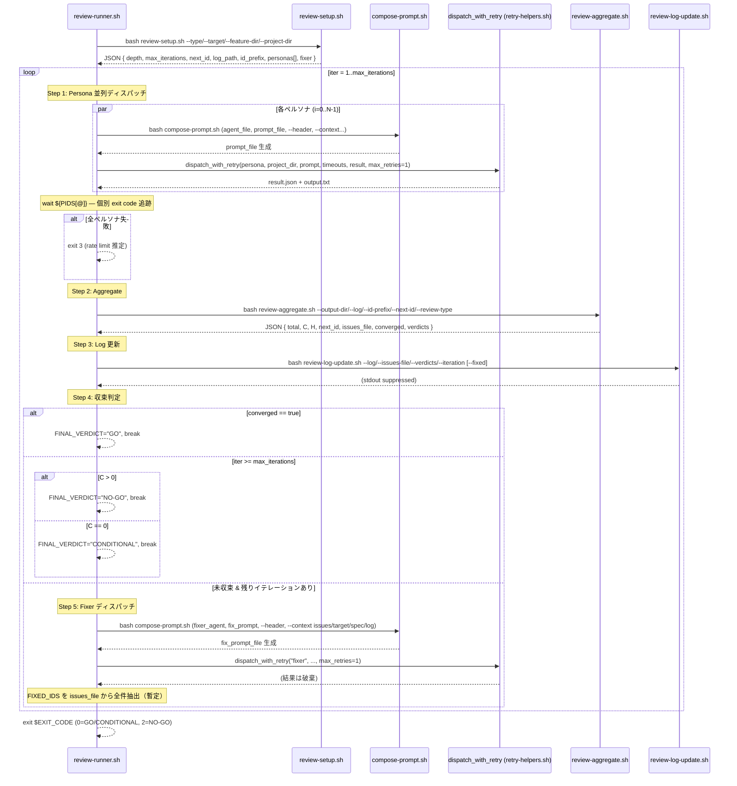

# Trace: review-runner.sh + review-setup.sh

> 対象ファイル:
> - `lib/review-runner.sh` (345 行)
> - `lib/review-setup.sh` (182 行)

---

## 1. Sequence Diagram (Mermaid)

レビューループ全体のフローを示す。review-runner はペルソナ並列ディスパッチ → 集約 → 収束判定 → Fixer を最大 `max_iterations` 回繰り返す。



---

## 2. Parallel Dispatch Lifecycle

ペルソナは `&` でバックグラウンドプロセスとして並列起動される。

### 起動フェーズ (L90-187)

```
OUTPUT_DIR = mktemp -d "/tmp/review-personas-$$.XXXXXX"
PIDS=()
PERSONA_NAMES=()
```

各ペルソナについて:

1. **コマンドファイル解決** (L102-125): `command_variant` 対応。候補パスを順に探索:
   - `$PROJECT_DIR/commands/poor-dev.${PERSONA_NAME}-${CMD_VARIANT}.md`
   - `$PROJECT_DIR/.opencode/command/poor-dev.${PERSONA_NAME}-${CMD_VARIANT}.md`
   - variant なしフォールバック: `commands/` → `.opencode/command/`
   - 見つからなければ `continue`（skip）

2. **エージェントファイル解決** (L128-135): 4 候補パスを順に探索:
   - `agents/opencode/${PERSONA_NAME}.md`
   - `agents/claude/${PERSONA_NAME}.md`
   - `.opencode/agents/${PERSONA_NAME}.md`
   - `.claude/agents/${PERSONA_NAME}.md`

3. **compose-prompt 呼び出し** (L139-166): `${AGENT_FILE:-$COMMAND_FILE}` を第 1 引数として使用。コンテキストとして target（ファイルまたはディレクトリ内 impl ファイル最大 20 件）、spec.md、review-log を付与。

4. **バックグラウンドディスパッチ** (L175-187):
   ```bash
   (
     dispatch_with_retry "$PERSONA_NAME" "$PROJECT_DIR" "$PROMPT_FILE" \
       "$IDLE_TIMEOUT" "$PERSONA_TIMEOUT" "$RESULT_FILE" 1 > /dev/null 2>&1
     # output ファイルを OUTPUT_DIR にコピー
     PERSONA_OUTPUT=$(ls -t /tmp/poor-dev-output-${PERSONA_NAME}-*.txt 2>/dev/null | head -1 || true)
     cp "$PERSONA_OUTPUT" "$OUTPUT_DIR/${PERSONA_NAME}.txt"
     rm -f "$PROMPT_FILE"
   ) &
   PIDS+=($!)
   PERSONA_NAMES+=("$PERSONA_NAME")
   ```
   - サブシェル `( ... ) &` で起動し PID を `PIDS` 配列に記録
   - `max_retries=1` 固定（retry-helpers 側の再試行は 1 回まで）

### 待機フェーズ (L192-197)

```bash
FAILED_COUNT=0
for ((i=0; i<${#PIDS[@]}; i++)); do
  if ! wait "${PIDS[$i]}" 2>/dev/null; then
    FAILED_COUNT=$((FAILED_COUNT + 1))
    # JSONL で失敗ペルソナを報告
  fi
done
```

- 各 PID を `wait` で個別に待機し、失敗数をカウント
- `wait` の exit code がサブシェル内の最終コマンドの exit code に対応

### 全滅検知 (L200-204)

```bash
if [[ "$FAILED_COUNT" -eq "${#PIDS[@]}" && "${#PIDS[@]}" -gt 0 ]]; then
  exit 3   # rate limit 推定
fi
```

- 全ペルソナが失敗した場合、レートリミットと判断して `exit 3`
- `OUTPUT_DIR` を `rm -rf` してクリーンアップ

---

## 3. Error Handling

| Location | Exit Code | Behavior | 条件 |
|---|---|---|---|
| 全ペルソナ失敗 (L200-204) | `exit 3` | Rate limit 推定。即座に終了 | `FAILED_COUNT == len(PIDS) && len(PIDS) > 0` |
| 最終判定 NO-GO (L250-251) | `exit 2` | 最大イテレーション到達、Critical 指摘残存 | `iter >= max_iter && C > 0` |
| 最終判定 CONDITIONAL (L253) | `exit 0` | 部分的収束。Critical はないが完全収束せず | `iter >= max_iter && C == 0` |
| 収束 GO (L241-246) | `exit 0` | 全指摘解消またはペルソナ全員 GO | `converged == true` |
| コマンドファイル未検出 (L122-125) | 継続 | 該当ペルソナをスキップし JSONL warning 出力 | `COMMAND_FILE` 空文字 |
| prompt 生成失敗 (L168-171) | 継続 | 該当ペルソナをスキップし JSONL warning 出力 | `PROMPT_FILE` 不存在 |
| Fixer ディスパッチ失敗 (L320-322) | 継続 | `|| { ... }` で warning 出力、ループ続行 | `dispatch_with_retry` 非ゼロ終了 |
| Fixer コマンド/エージェント未検出 (L328-330) | 継続 | JSONL warning 出力、Fix なしで次イテレーションへ | `FIX_CMD_FILE` and `FIX_AGENT_FILE` 両方空 |

### Exit Code まとめ（最終出力 L337-345）

```bash
case "$FINAL_VERDICT" in
  GO)          EXIT_CODE=0 ;;
  CONDITIONAL) EXIT_CODE=0 ;;
  NO-GO)       EXIT_CODE=2 ;;
esac
```

呼び出し元（pipeline-runner 等）は exit code で分岐する:
- `0`: 成功（GO or CONDITIONAL）
- `2`: 未収束（NO-GO、Critical 残存）
- `3`: レートリミット推定（全ペルソナ失敗）

---

## 4. `source` 依存関係

| ファイル | 行 | 提供関数/変数 | 用途 |
|---|---|---|---|
| `utils.sh` | L18 (runner), L20 (setup) | `json_get`, `json_get_or`, `die`, `read_config` | JSON パース、エラー終了、設定読み込み |
| `retry-helpers.sh` | L20 (runner のみ) | `dispatch_with_retry` | CLI ディスパッチ + リトライ + タイムアウト管理 |

### 外部コマンド依存

- `jq` — JSON 操作（PERSONAS_JSON 構築、SETUP パース、AGG パース）
- `git` — diff stats 取得（setup L112）
- `find` — ディレクトリターゲットのファイル列挙（runner L150, setup L108-109）
- `grep -oP` — PCRE パターンで ID 抽出（setup L147）、diff stats パース（setup L114-116）

---

## 5. [BUG] マーカー

### BUG-1: Fixer 出力未追跡

**場所**: `review-runner.sh` L318-326

```bash
dispatch_with_retry "fixer" "$PROJECT_DIR" "$FIX_PROMPT_FILE" \
  "$IDLE_TIMEOUT" "$PERSONA_TIMEOUT" "$FIX_RESULT_FILE" 1 > /dev/null 2>&1 || { ... }
rm -f "$FIX_PROMPT_FILE" "$FIX_RESULT_FILE"   # L323: 結果を破棄

# L326: issues_file から全 ID を抽出し「修正済み」と仮定
FIXED_IDS=$(cut -d'|' -f1 "$ISSUES_FILE" 2>/dev/null | tr '\n' ',' | sed 's/,$//' || true)
```

**問題点**:
- Fixer のディスパッチ結果（`FIX_RESULT_FILE`）は L323 で即座に `rm -f` される。Fixer が実際に何を修正したか検証していない。
- `FIXED_IDS` は issues_file の全 ID を機械的に抽出して設定（L326）。Fixer が一部しか修正していなくても全件修正済みとして次イテレーションの log-update に渡される。
- コメント `# all-as-fixed: 暫定` が示す通り、暫定実装のまま残っている。

**影響**: review-log に偽の修正記録が書き込まれ、次イテレーションで再検出されるまで見かけ上の収束度が実態と乖離する。

### BUG-2: ペルソナ出力ファイル解決の競合リスク

**場所**: `review-runner.sh` L180

```bash
PERSONA_OUTPUT=$(ls -t /tmp/poor-dev-output-${PERSONA_NAME}-*.txt 2>/dev/null | head -1 || true)
```

**問題点**:
- `/tmp/poor-dev-output-${PERSONA_NAME}-*.txt` のグロブは PID やタイムスタンプに依存しない名前パターン。前回実行の残存ファイルを拾う可能性がある。
- `ls -t`（更新時刻降順）で最新ファイルを取得するが、同一ペルソナ名で複数プロセスが同時に走った場合（異なるレビュータイプの並列実行など）、他プロセスの出力を誤取得するリスクがある。
- `dispatch_with_retry` 内部での出力ファイル命名規則との整合性が暗黙的で、契約として明文化されていない。

**影響**: 稀なケースだが、stale ファイルや他プロセスの出力を取り込み、集約結果が汚染される可能性。

---

## 6. Setup Logic (`review-setup.sh`)

### 6.1 ペルソナ解決 (L49-71)

`get_personas()` 関数が `review_type` からペルソナリストを返す。各レビュータイプに 4 ペルソナが固定割り当て:

| review_type | ペルソナ（4 名） |
|---|---|
| `planreview` | planreview-pm, planreview-critical, planreview-risk, planreview-value |
| `tasksreview` | tasksreview-junior, tasksreview-senior, tasksreview-techlead, tasksreview-devops |
| `architecturereview` | architecturereview-architect, architecturereview-performance, architecturereview-security, architecturereview-sre |
| `qualityreview` | qualityreview-code, qualityreview-qa, qualityreview-security, qualityreview-testdesign |
| `phasereview` | phasereview-qa, phasereview-ux, phasereview-regression, phasereview-docs |

不明なタイプは `die` で即座に終了。

### 6.2 CLI/モデル解決 (L77-97)

各ペルソナと fixer について `config-resolver.sh` を呼び出し:

```bash
RESOLVED=$(bash "$SCRIPT_DIR/config-resolver.sh" "$persona" ${CONFIG_PATH:+"$CONFIG_PATH"} 2>/dev/null \
  || echo '{"cli":"claude","model":"sonnet"}')
```

- `config-resolver.sh` が失敗した場合、フォールバック `{"cli":"claude","model":"sonnet"}` を使用
- `CONFIG_PATH` は `$PROJECT_DIR/.poor-dev/config.json`（L77）
- Fixer は `"fixer"` という名前で同じ resolver に問い合わせ（L95）

### 6.3 Depth 計算 (L99-138)

変更量に基づくレビュー深度の自動判定:

```
ディレクトリターゲット → find で impl ファイルの合計行数 + ファイル数
ファイルターゲット     → git diff --stat HEAD で insertion + deletion + ファイル数
```

| 条件 | depth | max_iterations |
|---|---|---|
| `TOTAL_CHANGES > 500` OR `FILES_CHANGED > 20` | `deep` | 5 |
| `TOTAL_CHANGES < 50` AND `FILES_CHANGED < 5` | `light` | 2 |
| それ以外 | `standard` | 3 |

config の `review_depth` が `"auto"` 以外の場合はオーバーライド（L130-138）。

### 6.4 Review Log 初期化と ID 追跡 (L140-159)

```bash
LOG_PATH="$FD/review-log-${REVIEW_TYPE}.yaml"
NEXT_ID=1

if [[ -f "$LOG_PATH" ]]; then
  MAX_ID=$(grep -oP '[A-Z]+(\d+)' "$LOG_PATH" | grep -oP '\d+' | sort -n | tail -1 || echo "0")
  NEXT_ID=$((MAX_ID + 1))
fi
```

- ログファイルパス: `$FEATURE_DIR/review-log-${REVIEW_TYPE}.yaml`
- 既存ログがある場合、`[A-Z]+(\d+)` パターンで最大 ID を検索し、`NEXT_ID = MAX_ID + 1` とする
- ID プレフィックス: review_type に応じて `PR`/`TR`/`AR`/`QR`/`PH`/`RV`

---

## 7. [CONTRACT] マーカー

### CONTRACT: ReviewSetupResult (L163-182)

`review-setup.sh` の stdout に出力される JSON 構造。`review-runner.sh` が `.depth`, `.max_iterations`, `.next_id`, `.log_path`, `.id_prefix`, `.personas[]`, `.fixer` を参照する。

```json
{
  "depth": "standard|deep|light",
  "max_iterations": 2|3|5,
  "next_id": <number>,
  "log_path": "<absolute_path>/review-log-<type>.yaml",
  "id_prefix": "PR|TR|AR|QR|PH|RV",
  "review_type": "<review_type>",
  "personas": [
    {
      "name": "<persona_name>",
      "cli": "claude|opencode",
      "model": "<model_id>",
      "agent_name": "<persona_name>"
    }
  ],
  "fixer": {
    "cli": "claude|opencode",
    "model": "<model_id>",
    "agent_name": "review-fixer"
  }
}
```

**消費者**:
- `review-runner.sh` L69-74: `json_get` で各フィールドを取得
- `review-runner.sh` L94-98: `.personas[$i].name`, `.personas[$i].cli`, `.personas[$i].model`
- `review-runner.sh` L277: `.fixer.agent_name`

### CONTRACT: PoorDevConfig

`read_config` (`utils.sh`) が返す JSON。以下のキーが参照される:

| キー | 参照箇所 | デフォルト |
|---|---|---|
| `.polling.idle_timeout` | runner L50 | `120` |
| `.polling.max_timeout` | runner L51 | `300` |
| `.polling.step_timeouts[$s].max_timeout` | runner L54 | (未設定時はグローバル値) |
| `.polling.step_timeouts[$s].idle_timeout` | runner L56 | (未設定時はグローバル値) |
| `.command_variant` | runner L105 | `''` (空文字) |
| `.review_depth` | setup L130 | `'auto'` |

---

## 8. [KEEP-BASH] 境界

外部プロセスとして `bash` で呼び出されるスクリプト。TS 移植時にもプロセス境界として維持する候補。

| スクリプト | 呼び出し元 | 行 | 呼び出し方 |
|---|---|---|---|
| `compose-prompt.sh` | review-runner.sh | L166, L315 | `bash "$SCRIPT_DIR/compose-prompt.sh" "${COMPOSE_ARGS[@]}"` |
| `dispatch-step.sh` | review-runner.sh (間接) | — | `dispatch_with_retry` 内部で呼び出し |
| `config-resolver.sh` | review-setup.sh | L82, L95 | `bash "$SCRIPT_DIR/config-resolver.sh" "$persona" ...` |
| `review-aggregate.sh` | review-runner.sh | L210-215 | `bash "$SCRIPT_DIR/review-aggregate.sh" --output-dir ...` |
| `review-log-update.sh` | review-runner.sh | L229-234 | `bash "$SCRIPT_DIR/review-log-update.sh" --log ...` |
| `review-setup.sh` | review-runner.sh | L63-67 | `bash "$SCRIPT_DIR/review-setup.sh" --type ...` |

### プロセス境界の理由

- **compose-prompt.sh**: テンプレート展開ロジックが独立。入力（コマンドファイル + コンテキスト）→ 出力（プロンプトファイル）の純粋な変換。
- **dispatch-step.sh**: CLI プロセス起動 + ポーリング。タイムアウト管理が独自のプロセスライフサイクルに依存。
- **config-resolver.sh**: 設定ファイル解決ロジック。フォールバック付きで `2>/dev/null || echo '{...}'` パターンでエラー隔離されている。
- **review-aggregate.sh**: 出力ディレクトリの複数ファイルをパースし集約。独立した集約ロジック。
- **review-log-update.sh**: YAML ファイルの更新。review-runner のメインループとは関心が異なる。

---

## 9. データフロー詳細

### イテレーション内のデータ流通

```
[SETUP]
  review-setup.sh → JSON (SETUP変数)
     ├── .personas[]     → ペルソナ名・CLI・モデル
     ├── .fixer          → Fixer の CLI・モデル・エージェント名
     ├── .depth          → レビュー深度
     ├── .max_iterations → ループ上限
     ├── .next_id        → 次の Issue ID
     ├── .log_path       → review-log YAML パス
     └── .id_prefix      → ID プレフィックス

[ITERATION N]
  compose-prompt.sh × N ペルソナ → /tmp/poor-dev-prompt-${NAME}-$$.txt
  dispatch_with_retry × N       → /tmp/poor-dev-output-${NAME}-*.txt
       ↓ (cp to OUTPUT_DIR)
  OUTPUT_DIR/${NAME}.txt × N
       ↓
  review-aggregate.sh           → JSON (AGG変数)
     ├── .total, .C, .H         → 指摘件数
     ├── .next_id                → 更新された次 ID (NEXT_ID を上書き)
     ├── .issues_file            → 指摘一覧ファイルパス
     ├── .converged              → 収束フラグ
     └── .verdicts               → ペルソナ別判定文字列
       ↓
  review-log-update.sh          → review-log YAML 更新
       ↓
  [収束判定]
       ↓ (未収束の場合)
  compose-prompt.sh (fixer)     → /tmp/poor-dev-prompt-fixer-$$.txt
  dispatch_with_retry (fixer)   → (結果破棄)
  FIXED_IDS = issues_file 全 ID → 次イテレーションの log-update に渡す
```

### 一時ファイル管理

| ファイル/ディレクトリ | 作成 | 削除 | 備考 |
|---|---|---|---|
| `/tmp/review-personas-$$.XXXXXX/` | L90 `mktemp -d` | L244, L256, L332 `rm -rf` | 各イテレーション終了時 |
| `/tmp/poor-dev-prompt-${NAME}-$$.txt` | L101 (compose-prompt が書き込み) | L184 `rm -f` | サブシェル内で削除 |
| `/tmp/poor-dev-output-${NAME}-*.txt` | dispatch_with_retry 内部 | 明示的削除なし | [BUG-2] の原因 |
| `/tmp/poor-dev-prompt-fixer-$$.txt` | L265 | L323 `rm -f` | |
| `/tmp/poor-dev-result-fixer-$$.json` | L318 | L323 `rm -f` | 結果未検証で削除 [BUG-1] |

---

## 10. Config タイムアウト解決順序

review-runner.sh L49-57 のタイムアウト解決ロジック:

```
1. グローバルデフォルト: idle_timeout=120, max_timeout=300
2. config .polling.idle_timeout / .polling.max_timeout でオーバーライド
3. config .polling.step_timeouts[review_type].idle_timeout / .max_timeout で更にオーバーライド
```

`step_timeouts` はレビュータイプ別にタイムアウトを細かく制御するための機構。未設定なら `// empty` で空文字が返り、条件 `[[ -n "$_st" && "$_st" != "null" ]]` でスキップされる。
